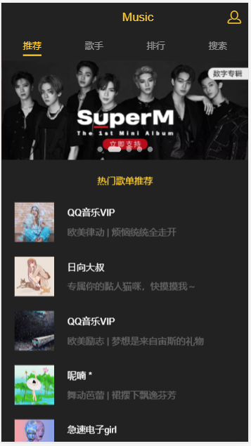

杨老师您好啊
在utils下有一个jsonp API来获取到网上的数据
在api下有个文件recommend可以正常爬取到网的数据一些轮播图的数据
我想获取这个地址给https://c.y.qq.com/splcloud/fcgi-bin/fcg_get_diss_by_tag.fcg?picmid=1&rnd=0.07609896458439769&g_tk=1138609162&loginUin=2661706455&hostUin=0&format=json&inCharset=utf8&outCharset=utf-8&notice=0&platform=yqq.json&needNewCode=0&categoryId=10000000&sortId=5&sin=0&ein=19
的数据有限制了
# vue-music
#推荐歌单


## Project setup
```
yarn install
```

### Compiles and hot-reloads for development
```
yarn run serve
```

### Compiles and minifies for production
```
yarn run build
```

### Run your tests
```
yarn run test
```

### Lints and fixes files
```
yarn run lint
```

### Customize configuration
See [Configuration Reference](https://cli.vuejs.org/config/).
